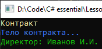

# Lesson4_addition_task
Условия задачки:
>Используя Visual Studio, создайте проект по шаблону Console Application.  
Требуется: Изменить 12 пример первого урока (работа с документом) и создать общий абстрактный класс для всех частей документа.  

Подытог: вот такенный майндфак на выходе
>
